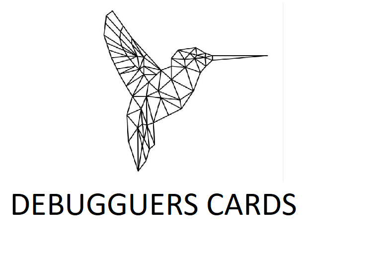

# Proyecto grupal Awesome profile-cards

## Autoras

- Bella García - [@bellita85](https://github.com/bellita85)
- Lara R. Poblet - [@lrpoblet](https://github.com/lrpoblet)
- María Somoza Jurado - [@MariaSJ](https://github.com/MariaSJ)
- Nayra Romero Salas - [@nayraromero](https://github.com/nayraromero)

## Resumen

Se trata de una aplicación web que permite crear una tarjeta de visita personalizada. En la página web podemos introducir nuestros datos profesionales y obtener una vista maquetada con esta información.

La aplicación funciona siguiendo estos pasos:

1. Permitir al usuario elegir el estilo de la tarjeta, eligiendo paleta de colores
2. Permitir al usuario que, mediante la introducción de información en un formulario, este texto se muestre maquetado automáticamente en un cuadro similar a una tarjeta de visita, que será la muestra del resultado final
3. Permitir que el usuario pueda crear una web con su tarjeta y compartirla por Twitter

## Especificaciones

El proyecto consta de 2 páginas:

- Una página landing de bienvenida
- Una página con la aplicación de crear tarjetas

En el desarrollo de esta aplicación web se han usado las siguientes tecnologías:

- Uso avanzado de formularios **HTML**
- Maquetación usando **CSS avanzado**, como flex y grid
- Uso de **mediaqueries** para que el diseño sea adaptable al dispositivo usando la estrategia **mobile first**
- Uso de **JavaScript**
- Gestión de **eventos en el navegador**
- Acceso y envío de datos a un **servidor**
- Almacenamiento en local usando **LocalStorage**
- Uso de **git** para el control de versiones del proyecto
- Publicación del resultado en Internet usando **GitHub Pages**

## Adalab Starter Kit

> NOTA: Necesitas tener instalado **Node JS** para trabajar con este Starter Kit e instalar las dependencias locales ejecutando en la terminal el comando:
> `npm install`

Para el proyecto se ha usado el Starter Kit de Adalab, creado en **node** y **gulp**.

Este Kit incluye un motor de plantillas HTML, el preprocesador SASS y un servidor local y muchas cosas más. Se ha usado para trabajar más cómodamente y automatizar tareas.

En el Kit hay 3 tipos de ficheros y carpetas:

- Los ficheros que están sueltos en la raíz del repositorio, como gulpfile.js, package.json... Son la configuración del proyecto y no se necesita modificarlos.
  La carpeta `src/`: son los ficheros de nuestra página web, como HTML, CSS, JS...
- Las carpetas `public/` y `docs/`, que son generadas automáticamente cuando arrancamos el proyecto. El Kit lee los ficheros que hay dentro de src/, los procesa y los genera dentro de public/ y docs/.

## API del back-end

La URL base del servicio es
https://awesome-profile-cards.herokuapp.com/

El API sigue una convención tipo REST para la gestión de tarjetas: creación y acceso a las mismas.

## Otros enlaces de interés

- Adalab Web Starter Kit: https://github.com/Adalab/adalab-web-starter-kit
- Favicon: https://icons8.com/
